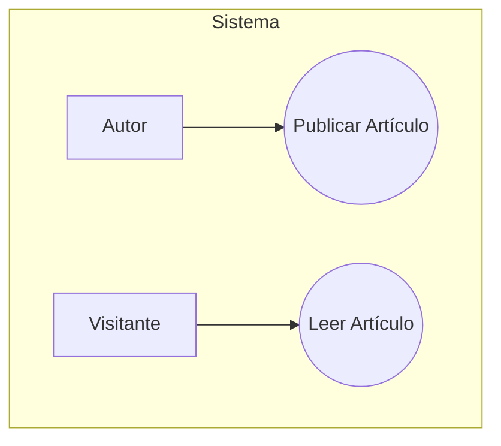

## Caso de Uso: Publicar Artículo

**Actor Principal:** Autor

**Resumen:** El Autor crea, edita y publica un nuevo artículo en el blog.

**Flujo Principal**
1. El Autor inicia sesión.
2. El Autor completa el formulario del artículo y presiona "Publicar".
3. El sistema valida y guarda el artículo.
4. El sistema muestra confirmación.
