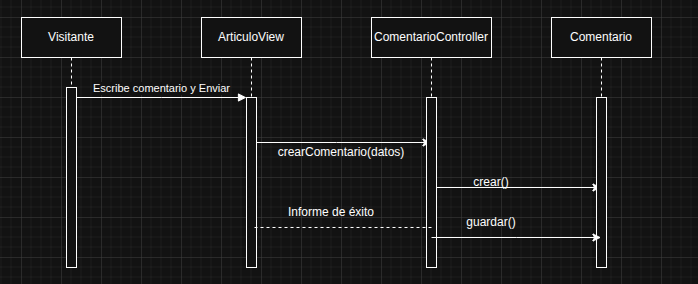
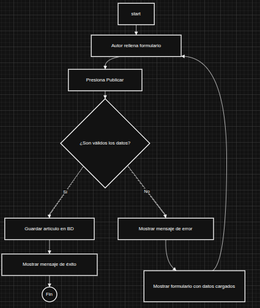

# 📚 Clase 2 - Diagramas UML de Estructura y Comportamiento

Aquí se documentan los principales diagramas UML que definen la estructura y las interacciones del sistema EzeBlog.

## 1. Diagrama de Clases

### Explicación
Este diagrama define las entidades clave del sistema (`Articulo`, `Usuario`, `Comentario`) y las relaciones estáticas entre ellas. Muestra el esqueleto que evolucionará en las Clases siguientes para incorporar nuevas funcionalidades (como la entidad `Categoria` de la Clase 4).

## 2. Diagrama de Secuencia

### Explicación
Modela la interacción temporal y el orden exacto en que los objetos se comunican para completar una tarea específica, como la publicación de un comentario o la autenticación de un usuario. Es crucial para visualizar el flujo de llamadas entre el Controlador, el Modelo y la Base de Datos.

## 3. Diagrama de Actividad

### Explicación
Visualiza el flujo de trabajo completo del proceso de publicación de un artículo, incluyendo los nodos de decisión (Ej: ¿Es válido el contenido?) y los caminos alternativos definidos en el Caso de Uso de la Clase 1.