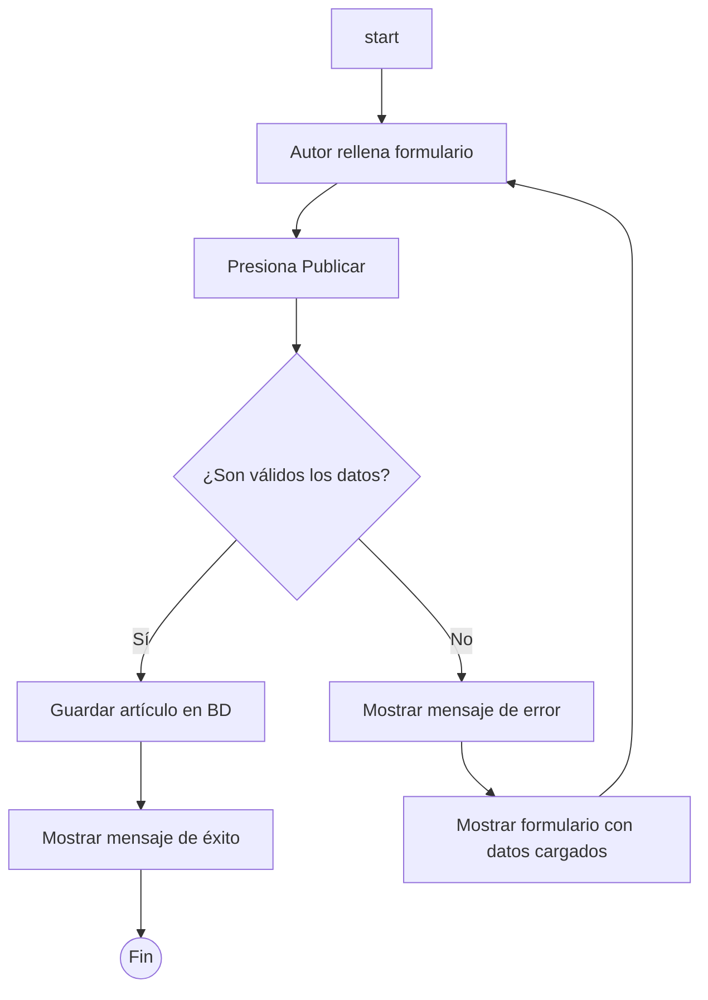

Análisis de la Imagen

Representa un sistema simple de gestión de artículos, posiblemente un blog o portal institucional. Muestra dos actores principales: **Autor** (representado por un ícono de persona) y **Visitante** (también representado por un ícono de persona). Los casos de uso incluyen **Publicar** (conectado al Autor y al objeto central **Artículo**), **Lectura** (conectado al Visitante y al **Artículo**), y el **Artículo** como entidad central que une ambos flujos. Las conexiones indican asociaciones: el Autor publica artículos, y el Visitante realiza lecturas de ellos. El diagrama es minimalista, con líneas de asociación direccionales que sugieren un flujo desde los actores hacia las acciones y el artículo resultante. No se muestran extensiones, inclusiones o generalizaciones complejas; es un modelo lineal enfocado en interacciones básicas.

A continuación, describo los casos de uso principales inferidos del diagrama, utilizando el formato del ejemplo proporcionado. He adaptado el contenido para que sea coherente con el diagrama, asumiendo flujos típicos de un sistema de blog (creación/publicación por autor y lectura por visitante). Para el caso de **Lectura**, agrego que la palabra clave "leer" se utiliza como trigger o término principal en el sistema (por ejemplo, en búsquedas o comandos para invocar la acción de lectura).

[diagrama](image.png)
