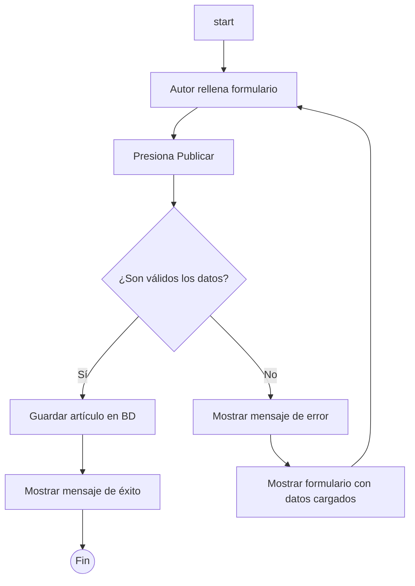

```mermaid
graph TD
    start --> Autor_rellena_formulario[Autor rellena formulario]
    Autor_rellena_formulario --> A[Presiona Publicar]
    A --> B{¿Son válidos los datos?}
    B -- Sí --> C[Guardar artículo en BD]
    C --> D[Mostrar mensaje de éxito]
    D --> E((Fin))
    B -- No --> F[Mostrar mensaje de error]
    F --> G[Mostrar formulario con datos cargados]
    G --> Autor_rellena_formulario
```
