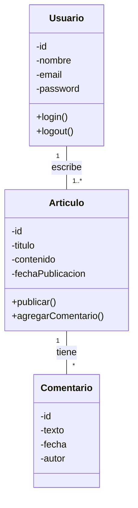

```mermaid
classDiagram
    class Usuario {
        -id
        -nombre
        -email
        -password
        +login()
        +logout()
    }
    class Articulo {
        -id
        -titulo
        -contenido
        -fechaPublicacion
        +publicar()
        +agregarComentario()
    }
    class Comentario {
        -id
        -texto
        -fecha
        -autor
    }

    Usuario "1" -- "1..*" Articulo : escribe
    Articulo "1" -- "*" Comentario : tiene
```
