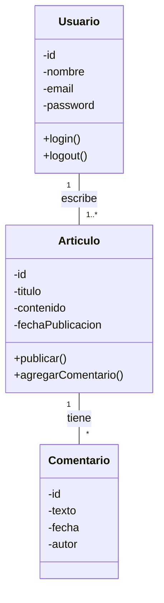

## 4. Manos a la Obra: Construyendo "Institución Digital"

### Tutorial Paso a Paso

**Paso 1: Evolucionar el Diagrama de Casos de Uso**

Con la nueva funcionalidad de comentarios, nuestro diagrama crece. Ahora el `Visitante` también participa en el caso de uso **`Comentar Artículo`**. El `Autor` también puede **`Leer Comentarios`**.

**Paso 2: Crear el Diagrama de Clases**

1.  **Identificar las Clases:** Mirando nuestros casos de uso (`Publicar Artículo`, `Leer Artículo`, `Comentar Artículo`), los sustantivos clave son: `Usuario`, `Articulo`, `Comentario`.
2.  **Definir Atributos y Métodos:**
    *   `Usuario`: necesitará `id`, `nombre`, `email`, `password`. Podrá `login()`, `logout()`.
    *   `Articulo`: tendrá `id`, `titulo`, `contenido`, `fechaPublicacion`. Podrá `publicar()`, `agregarComentario()`.
    *   `Comentario`: tendrá `id`, `texto`, `fecha`, `autor`.
3.  **Establecer Relaciones (¡La parte más importante!):**
    *   Un `Usuario` (en rol de Autor) escribe `1..*` (uno o muchos) `Articulo`s. Un `Articulo` es escrito por `1` solo `Usuario`.
    *   Un `Articulo` tiene `*` (cero o muchos) `Comentario`s. Un `Comentario` pertenece a `1` solo `Articulo`.
    *   Un `Usuario` (en rol de Visitante) escribe `*` (cero o muchos) `Comentario`s. Un `Comentario` es escrito por `1` solo `Usuario`.
4.  **Dibujar el Diagrama en diagrams.net:**

**Resultado Esperado (Diagrama de Clases):**



> **Nota para el estudiante:** Puedes copiar el código anterior y pegarlo en [mermaid.live](https://mermaid.live/) para visualizar el diagrama y experimentar con él.```mermaid


