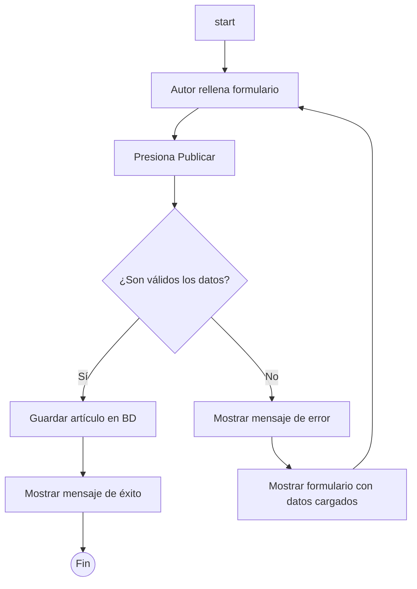
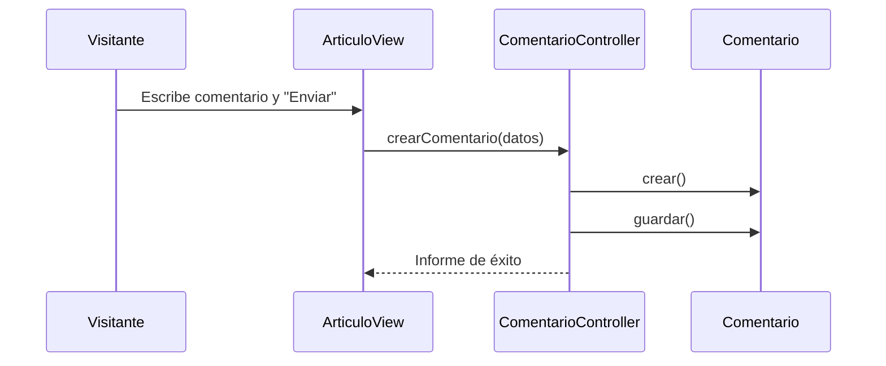

**Paso 4: Modelar un Proceso con un Diagrama de Actividad**

Modelemos el proceso de **`Publicar Artículo`**, que tiene una decisión importante.

1.  **Flujo:** Inicia -> El `Autor` rellena el formulario -> Presiona "Publicar".
2.  **Decisión:** El sistema verifica los datos. ¿Son válidos? (ej: ¿el título no está vacío?).
3.  **Flujo SI:** Se guarda el artículo en la base de datos -> Se muestra un mensaje de éxito -> Fin.
    4.  **Flujo NO:** Se muestra un mensaje de error -> El flujo vuelve a mostrar el formulario con los datos ya cargados para que el `Autor` corrija -> Fin.

**Resultado Esperado (Diagrama de Actividad):**

> **Nota para el estudiante:** Puedes copiar el código anterior y pegarlo en [mermaidchart.com/raw](https://mermaidchart.com/raw) para visualizar el 

