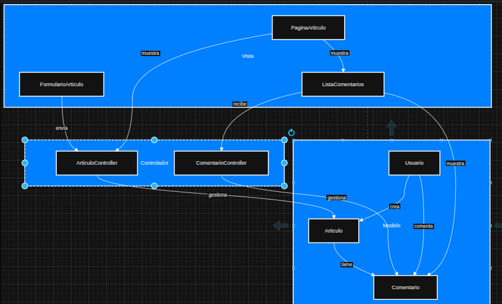
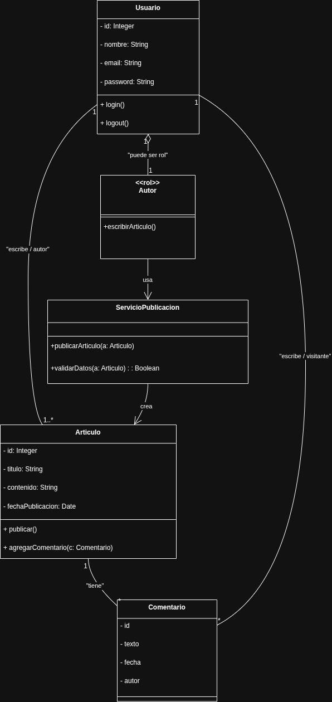

# 🏛️ Clase 3 - Arquitectura y Principios de Diseño

Esta clase se enfoca en la implementación de patrones arquitectónicos y principios de diseño para garantizar la robustez, mantenibilidad y escalabilidad del proyecto EzeBlog.

## 1. Arquitectura Modelo-Vista-Controlador (MVC)

### Explicación
El diagrama MVC muestra la división de responsabilidades:
* **Vista:** Encargada de la interfaz de usuario.
* **Controlador:** Maneja la lógica de la aplicación y las peticiones del usuario.
* **Modelo:** Gestiona la lógica de negocio y la persistencia de datos.
Esta separación asegura el bajo acoplamiento entre la interfaz y la lógica de negocio.

## 2. Refactor y Principios de Diseño

### Explicación
Este diagrama de clases refactorizado refuerza los principios de **Alta Cohesión** (cada clase tiene una única responsabilidad bien definida) y **Bajo Acoplamiento** (los cambios en una clase tienen un impacto mínimo en las otras). Se incorporan interfaces y patrones como el Facade o Factory para centralizar operaciones complejas.