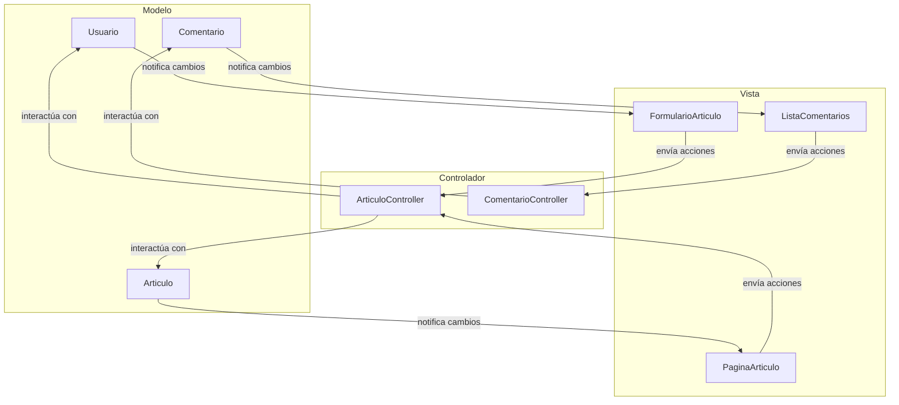

```mermaid
graph TD
    subgraph Modelo
        M1[Usuario]
        M2[Articulo]
        M3[Comentario]
    end

    subgraph Vista
        V1[FormularioArticulo]
        V2[PaginaArticulo]
        V3[ListaComentarios]
    end

    subgraph Controlador
        C1[ArticuloController]
        C2[ComentarioController]
    end

    V1 -- "envía acciones" --> C1
    V2 -- "envía acciones" --> C1
    V3 -- "envía acciones" --> C2

    C1 -- "interactúa con" --> M1
    C1 -- "interactúa con" --> M2
    C2 -- "interactúa con" --> M3

    M1 -- "notifica cambios" --> V1
    M2 -- "notifica cambios" --> V2
    M3 -- "notifica cambios" --> V3
```
