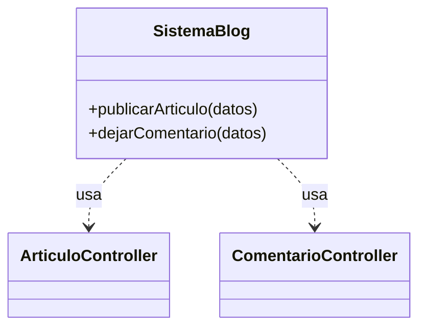

## Refactorización y Facade (Resumen)

Se propone una fachada (`SistemaBlog`) para reducir acoplamientos entre controladores y facilitar cambios futuros.

```mermaid
classDiagram
    class SistemaBlog {
        +publicarArticulo(datos)
        +dejarComentario(datos)
    }

    class ArticuloController
    class ComentarioController

    SistemaBlog ..> ArticuloController : usa
    SistemaBlog ..> ComentarioController : usa
```

