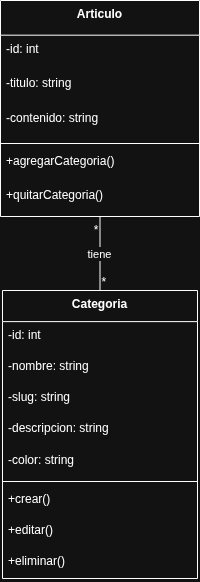

# 🏷️ Clase 4 - Versionado y Feature Único (Sistema de Categorías)

Esta documentación se centra en la implementación y modelado del Sistema de Categorías, el feature único de EzeBlog, y el uso profesional del versionado.

## 1. Modelado del Sistema de Categorías

### Explicación
Este diagrama introduce la nueva entidad `Categoria` y modela su relación de **Muchos a Muchos** con la entidad `Articulo`. Esto permite que un artículo pertenezca a múltiples categorías y que una categoría agrupe múltiples artículos, mejorando la organización y la navegación del blog.

## 2. Aspectos de Versionado y Entrega

### Versionado Semántico (SemVer)
* **v1.0.0:** Lanzamiento base del CMS.
* **v1.1.0:** Versión con el incremento **MINOR** que incluye el Sistema de Categorías Mejorado (la funcionalidad única) sin romper la compatibilidad.
### Documentación
Todos los cambios están registrados en el `CHANGELOG.md` y las releases están debidamente etiquetadas (`Tags`) en el repositorio.