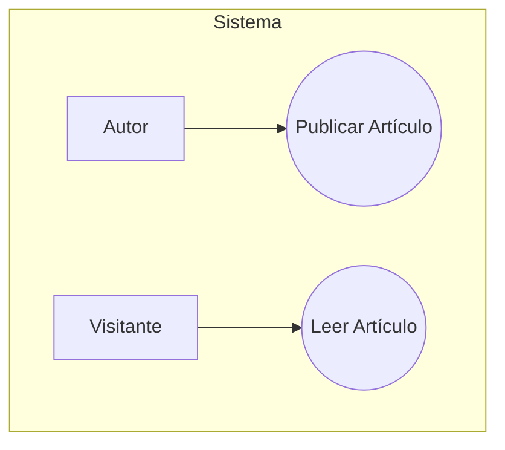

### 🏫 **Institución:** IES 9-018 "Gobernador Celso Jaque"
### 📚 **Carrera:** Tecnicatura Superior en Desarrollo de Software
### 📖 **Materia:** Modelado de Software
### 👨‍🏫 **Profesor:** Paulo Alvarez
---
# Clase 1: El Plano de Nuestro Proyecto - Casos de Uso y Git

## 1. Objetivos de la Clase

Al finalizar esta clase, serás capaz de:

*   Entender la visión de nuestro proyecto: el CMS "Institución Digital".
*   Explicar qué es el modelado de software y por qué es un paso crucial.
*   Identificar los requisitos funcionales de un sistema usando **Diagramas de Casos de Uso** de UML.
*   Guardar y documentar el trabajo realizado utilizando los comandos básicos de **Git** (`init`, `add`, `commit`).

---

## 2. Nuestro Proyecto: "Institución Digital"

Vamos a trabajar en un proyecto real y práctico a lo largo de estas clases: un **Sistema de Gestión de Contenidos (CMS) y Blog para una institución educativa**.

**La Visión:** La institución necesita una presencia online moderna. Quieren un sitio web donde puedan publicar noticias (en formato blog), gestionar páginas fijas (como "Quiénes Somos" o "Contacto"), y permitir que diferentes roles de usuario colaboren.

En esta primera etapa, nos enfocaremos en la funcionalidad más básica: **la publicación y lectura de artículos del blog.**

---

## 3. Conceptos Clave de Hoy

### 3.1. Modelado de Software y UML

*   **¿Qué es un Modelo?** Es una simplificación de la realidad. Al igual que un arquitecto crea un plano antes de construir una casa, nosotros creamos un modelo de software antes de escribir el código.
*   **¿Por qué Modelar?**
    *   **Para Entender:** Nos ayuda a comprender la complejidad del sistema.
    *   **Para Comunicar:** Nos da un lenguaje común (los diagramas) para hablar con nuestro equipo y con el cliente.
    *   **Para Prevenir Errores:** Es mucho más barato y fácil corregir un error en un diagrama que en un programa ya funcionando.
*   **Término Clave: `UML (Unified Modeling Language)` - Lenguaje de Modelado Unificado**
    *   **¿Qué es?** Es el estándar de la industria para crear los "planos" del software. Es un lenguaje visual, compuesto por diferentes tipos de diagramas.
    *   **¿Por qué se usa?** Para visualizar, especificar, construir y documentar un sistema de software.
    *   **¿Para qué sirve?** Nos permite describir el sistema desde diferentes perspectivas: la del usuario (¿qué hace?) y la del desarrollador (¿cómo está construido?).

### 3.2. Diagramas de Casos de Uso: La Visión del Usuario

Este es nuestro punto de partida. Describe **qué hace el sistema** desde la perspectiva de quien lo usa, sin preocuparse por el *cómo* lo hace.

*   **Término Clave: `Actor`**
    *   **¿Qué es?** Un rol que interactúa con nuestro sistema. Puede ser una persona (un `Lector`), otro sistema o incluso un temporizador.
    *   **¿Por qué se usa?** Para identificar quién o qué utilizará la funcionalidad que vamos a construir.
    *   **¿Cómo se representa?** Como una figura de palo (stickman).

*   **Término Clave: `Use Case` - Caso de Uso**
    *   **¿Qué es?** Una funcionalidad específica que el sistema ofrece a un actor. Debe ser una acción completa que aporte un valor visible para el actor.
    *   **¿Por qué se usa?** Para definir el alcance funcional del sistema. La suma de todos los casos de uso es todo lo que el sistema hará.
    *   **¿Cómo se representa?** Como un óvalo con un nombre de acción dentro (ej: "Publicar Artículo").

---

## 4. Manos a la Obra: Modelando "Institución Digital"

### Tutorial Paso a Paso

**Herramienta:** Usaremos [diagrams.net](https://diagrams.net), una herramienta online y gratuita.

**Paso 1: Identificar los Actores**

Leamos nuestra visión del proyecto. Para la funcionalidad básica del blog, ¿quiénes interactúan con él?

1.  Alguien que escribe los artículos: lo llamaremos **`Autor`**.
2.  Alguien que lee los artículos: lo llamaremos **`Visitante`**.

**Paso 2: Identificar los Casos de Uso**

Ahora, pensemos en las acciones principales que estos actores querrán realizar:

*   El `Autor` querrá **`Publicar Artículo`**.
*   El `Visitante` querrá **`Leer Artículo`**.

Por ahora, es así de simple. ¡Ya tenemos los requisitos funcionales básicos!

**Paso 3: Dibujar el Diagrama**

1.  Abre [diagrams.net](https://diagrams.net).
2.  A la izquierda, en el menú de formas, busca la sección de **UML**.
3.  Arrastra dos `Actor` al lienzo y nombra a uno "Autor" y al otro "Visitante".
4.  Arrastra dos `Use Case` al lienzo y nómbralos "Publicar Artículo" y "Leer Artículo".
5.  Conecta a los actores con sus casos de uso usando una línea simple (`Association`). El `Autor` se conecta con `Publicar Artículo` y el `Visitante` con `Leer Artículo`.

**Resultado Esperado:**



> **Nota para el estudiante:** Puedes copiar el código anterior y pegarlo en [mermaid.live](https://mermaid.live/) para visualizar el diagrama y experimentar con él.


**Paso 4: Describir un Caso de Uso**

Un diagrama no es suficiente. Necesitamos detallar qué significa cada caso de uso. Elijamos "Publicar Artículo":

```
**Caso de Uso:** Publicar Artículo

**Actor Principal:** Autor

**Resumen:** El Autor crea, edita y publica un nuevo artículo en el blog de la institución.

**Flujo Principal (el "camino feliz")**
1. El Autor inicia sesión en el sistema.
2. El sistema presenta al Autor un formulario para crear un nuevo artículo (con campos para título, contenido, etc.).
3. El Autor completa el formulario y presiona "Publicar".
4. El sistema valida los datos, guarda el artículo en la base de datos con estado "Publicado".
5. El sistema muestra un mensaje de confirmación y redirige al Autor a la lista de sus artículos.

**Flujos Alternativos (¿qué podría salir mal?)**
*   **4a. Datos inválidos:** Si el título está vacío, el sistema muestra un error y no guarda el artículo.
```

---

## 5. Control de Versiones con Git: Guardando Nuestro Trabajo

El modelado es parte de nuestro proyecto, y como todo proyecto, debemos guardar su historial. Para esto usamos **Git**, un sistema de control de versiones.

**¿Por qué usar Git?**

*   **Historial Completo:** Nos permite ver quién cambió qué y cuándo.
*   **Trabajo en Equipo:** Facilita que varias personas trabajen en el mismo proyecto sin pisarse.
*   **Seguridad:** Si cometemos un error grave, podemos "viajar en el tiempo" a una versión anterior que funcionaba.

### Comandos de Git para Hoy

*(Estos comandos se ejecutan en una terminal o línea de comandos en la carpeta de tu proyecto)*

1.  **`git init`**
    *   **¿Qué hace?** Inicializa un nuevo repositorio de Git. Crea una carpeta oculta `.git` donde se guardará todo el historial.
    *   **¿Cuándo se usa?** **Una sola vez** al inicio de un proyecto.
    *   **Comando:** `git init`

2.  **`git add <archivo>`**
    *   **¿Qué hace?** Añade un archivo al "área de preparación" (staging area). Imagina que es como poner los documentos que quieres guardar en un sobre antes de sellarlo.
    *   **¿Cuándo se usa?** Cada vez que creas o modificas un archivo que quieres incluir en el próximo "punto de guardado".
    *   **Comando:** `git add clase-1-introduccion-uml.md` (o `git add .` para añadir todos los archivos modificados).

3.  **`git commit -m "Tu mensaje descriptivo"`**
    *   **¿Qué hace?** Crea un "punto de guardado" permanente (un commit) con los archivos que están en el área de preparación. El mensaje es **obligatorio** y debe describir qué cambiaste.
    *   **¿Cuándo se usa?** Cuando has completado una unidad de trabajo lógica (ej. "Creación del diagrama de casos de uso inicial").
    *   **Comando:** `git commit -m "feat: Creación del diagrama de casos de uso para el blog"`

**Nuestro Flujo de Trabajo Hoy:**

1.  Crea una carpeta para el proyecto, ej: `institucion-digital`.
2.  Dentro, guarda el diagrama que hiciste y este archivo `clase-1-introduccion-uml.md`.
3.  Abre una terminal en esa carpeta y ejecuta:
    ```bash
    git init
    git add .
    git commit -m "Initial commit: Creación del Diagrama de Casos de Uso v1"
    ```

¡Felicidades! Has creado tu primer modelo y lo has guardado profesionalmente.

---

## 6. Recursos Adicionales

Para reforzar lo aprendido, te recomiendo estos videos:

*   **Video Principal (Casos de Uso):** [Diagrama de Casos de Uso - PARTE TEORICA | UML desde CERO | Buhoos](https://www.youtube.com/watch?v=u-V_j2aH12c)
    *   *Ideal para entender los conceptos básicos de actores y casos de uso desde cero.*

*   **Video Complementario (Relaciones):** [Curso UML. Diagrama de casos de Uso II. Relaciones. Vídeo 6 - pildorasinformaticas](https://www.youtube.com/watch?v=iL2a4I3n2eA)
    *   *Perfecto para cuando quieras entender las relaciones `<<include>>` y `<<extend>>` que veremos más adelante.*

---

## 7. Resumen y Próximos Pasos

Hoy hemos definido **QUÉ** hará nuestro sistema desde la perspectiva del usuario. Hemos creado nuestro primer plano: el Diagrama de Casos de Uso.

En la **Clase 2**, empezaremos a diseñar el **CÓMO**. Responderemos a la pregunta: ¿qué "piezas" de software (clases) necesitamos para construir estas funcionalidades? Pasaremos de la visión del usuario a la visión del arquitecto de software.


### Análisis de la Imagen

La imagen proporcionada es un diagrama de casos de uso (UML Use Case Diagram) que representa un sistema simple de gestión de artículos, posiblemente un blog o portal institucional. Muestra dos actores principales: **Autor** (representado por un ícono de persona) y **Visitante** (también representado por un ícono de persona). Los casos de uso incluyen **Publicar** (conectado al Autor y al objeto central **Artículo**), **Lectura** (conectado al Visitante y al **Artículo**), y el **Artículo** como entidad central que une ambos flujos. Las conexiones indican asociaciones: el Autor publica artículos, y el Visitante realiza lecturas de ellos. El diagrama es minimalista, con líneas de asociación direccionales que sugieren un flujo desde los actores hacia las acciones y el artículo resultante. No se muestran extensiones, inclusiones o generalizaciones complejas; es un modelo lineal enfocado en interacciones básicas.

A continuación, describo los casos de uso principales inferidos del diagrama, utilizando el formato del ejemplo proporcionado. He adaptado el contenido para que sea coherente con el diagrama, asumiendo flujos típicos de un sistema de blog (creación/publicación por autor y lectura por visitante). Para el caso de **Lectura**, agrego que la palabra clave "leer" se utiliza como trigger o término principal en el sistema (por ejemplo, en búsquedas o comandos para invocar la acción de lectura).

#### Caso de Uso: Publicar Artículo
**Actor Principal:** Autor  
**Resumen:** El Autor crea, edita y publica un nuevo artículo en el sistema de blog institucional, contribuyendo al repositorio de contenidos.  
**Flujo Principal (el "camino feliz")**  
1. El Autor inicia sesión en el sistema con sus credenciales.  
2. El sistema presenta al Autor un formulario para crear un nuevo artículo (con campos para título, contenido, imágenes, etc.).  
3. El Autor completa el formulario, realiza ediciones si es necesario, y presiona "Publicar".  
4. El sistema valida los datos, guarda el artículo en la base de datos con estado "Publicado" y lo asocia al perfil del Autor.  
5. El sistema muestra un mensaje de confirmación y redirige al Autor a la lista de sus artículos publicados.  

**Flujos Alternativos (¿qué podría salir mal?)**  
* **4a. Datos inválidos:** Si el título está vacío o el contenido excede el límite de caracteres, el sistema muestra un error específico y permite al Autor corregir sin perder el borrador.  
* **3a. Guardado como borrador:** Si el Autor selecciona "Guardar como borrador" en lugar de "Publicar", el artículo se almacena con estado "Borrador" para edición posterior.

#### Caso de Uso: Lectura de Artículo
**Actor Principal:** Visitante  
**Resumen:** El Visitante accede y lee un artículo publicado en el blog institucional, permitiendo la consulta de contenidos sin necesidad de autenticación. Nota: La palabra clave "leer" se toma como trigger principal en el sistema (por ejemplo, en barras de búsqueda o comandos para invocar directamente la visualización del artículo).  
**Flujo Principal (el "camino feliz")**  
1. El Visitante accede al sistema de blog sin iniciar sesión (acceso público).  
2. El sistema presenta una lista de artículos disponibles o permite búsqueda por título o palabra clave (ej. "leer [título]").  
3. El Visitante selecciona un artículo o ingresa la palabra clave "leer" seguida del identificador del artículo.  
4. El sistema recupera el artículo de la base de datos y lo muestra en formato legible (con título, contenido, autor y fecha).  
5. El sistema registra la lectura opcionalmente (para métricas) y permite al Visitante navegar a otros artículos relacionados.  

**Flujos Alternativos (¿qué podría salir mal?)**  
* **2a. Artículo no encontrado:** Si la búsqueda con "leer" no coincide con ningún artículo, el sistema muestra un mensaje de "Artículo no disponible" y sugiere artículos similares.  
* **4a. Contenido restringido:** Si el artículo está marcado como "Borrador" o privado, el sistema redirige al Visitante a la página principal con un aviso de acceso denegado.