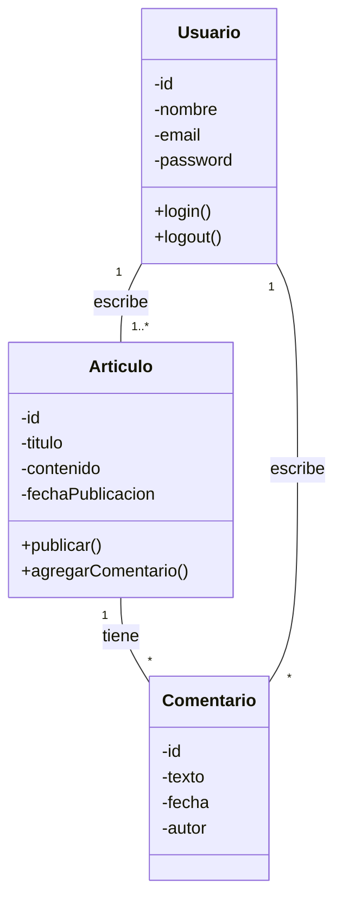

### 🏫 **Institución:** IES 9-018 "Gobernador Celso Jaque"
### 📚 **Carrera:** Tecnicatura Superior en Desarrollo de Software
### 📖 **Materia:** Modelado de Software
### 👨‍🏫 **Profesor:** Paulo Alvarez
---
# Clase 2: Construyendo los Cimientos - Clases, Secuencias y Ramas de Git

## 1. Objetivos de la Clase

Al finalizar esta clase, serás capaz de:

*   Traducir los requisitos funcionales a una estructura de software usando **Diagramas de Clases**.
*   Modelar la interacción y colaboración entre objetos con **Diagramas de Secuencia**.
*   Describir flujos de trabajo complejos y con decisiones usando **Diagramas de Actividad**.
*   Trabajar de forma segura en nuevas funcionalidades usando **ramas (branches)** en Git.

---

## 2. Nuestro Proyecto: "Institución Digital"

En la clase anterior, definimos QUÉ haría nuestro sistema. Hoy, diseñaremos el CÓMO. Vamos a ampliar la funcionalidad de nuestro blog añadiendo **comentarios**. Un `Visitante` ahora podrá dejar comentarios en un `Artículo`, y un `Autor` podrá ver los comentarios de sus artículos.

---

## 3. Conceptos Clave de Hoy

### 3.1. Diagrama de Clases: El ADN de Nuestro Software

Si los Casos de Uso son la cara visible del sistema, el Diagrama de Clases es su esqueleto. Describe las "plantillas" (Clases) que usaremos para crear los objetos que componen nuestro sistema.

*   **Término Clave: `Class` - Clase**
    *   **¿Qué es?** Una plantilla para crear objetos. Define un conjunto de atributos (datos) y métodos (comportamientos).
    *   **Ejemplo:** La clase `Articulo` define que todos los artículos tendrán un `titulo`, un `contenido` y un método para `publicar()`.
    *   **¿Cómo se representa?** Un rectángulo con tres compartimentos: Nombre, Atributos y Métodos.

*   **Término Clave: `Attribute` - Atributo**
    *   **¿Qué es?** Una característica o dato que pertenece a una clase. Tiene un nombre y un tipo (ej: `titulo: String`).
    *   **Visibilidad:** Se usa un símbolo para definir quién puede acceder al atributo:
        *   `+` **Público:** Cualquiera puede acceder. (Se usa poco para atributos).
        *   `-` **Privado:** Solo la propia clase puede acceder. (¡Es la práctica recomendada!)

*   **Término Clave: `Method` - Método**
    *   **¿Qué es?** Una acción o comportamiento que una clase puede realizar (ej: `guardarEnBD(): boolean`).

*   **Término Clave: `Relationship` - Relación**
    *   **¿Qué es?** Es la forma en que las clases se conectan entre sí.
    *   **Asociación:** La relación más común. Indica que dos clases se conocen. Se representa con una línea. Es crucial definir la **multiplicidad**: cuántos objetos de una clase se relacionan con la otra.
        *   `1` (uno y solo uno)
        *   `*` (cero o muchos)
        *   `1..*` (uno o muchos)
        *   `0..1` (cero o uno)

### 3.2. Diagrama de Secuencia: Una Conversación entre Objetos

Este diagrama es como una obra de teatro. Muestra, paso a paso, cómo los objetos "hablan" entre sí (envían mensajes) para cumplir un objetivo (un caso de uso).

*   **Término Clave: `Lifeline` - Línea de Vida**
    *   **¿Qué es?** Una línea punteada vertical que representa la vida de un objeto durante la interacción.

*   **Término Clave: `Message` - Mensaje**
    *   **¿Qué es?** Una comunicación de un objeto a otro, usualmente una llamada a un método. Se dibuja como una flecha.

### 3.3. Diagrama de Actividad: Un Flujo de Trabajo Visual

Es un diagrama de flujo avanzado, ideal para modelar procesos que tienen pasos, decisiones y posibles flujos paralelos.

*   **Término Clave: `Action` - Acción**
    *   **¿Qué es?** Un paso en el flujo de trabajo. Se dibuja como un rectángulo redondeado.

*   **Término Clave: `Decision Node` - Nodo de Decisión**
    *   **¿Qué es?** Un punto donde el flujo se divide según una condición (ej: "¿El usuario está registrado?"). Se dibuja como un rombo.

---

## 4. Manos a la Obra: Construyendo "Institución Digital"

### Tutorial Paso a Paso

**Paso 1: Evolucionar el Diagrama de Casos de Uso**

Con la nueva funcionalidad de comentarios, nuestro diagrama crece. Ahora el `Visitante` también participa en el caso de uso **`Comentar Artículo`**. El `Autor` también puede **`Leer Comentarios`**.

**Paso 2: Crear el Diagrama de Clases**

1.  **Identificar las Clases:** Mirando nuestros casos de uso (`Publicar Artículo`, `Leer Artículo`, `Comentar Artículo`), los sustantivos clave son: `Usuario`, `Articulo`, `Comentario`.
2.  **Definir Atributos y Métodos:**
    *   `Usuario`: necesitará `id`, `nombre`, `email`, `password`. Podrá `login()`, `logout()`.
    *   `Articulo`: tendrá `id`, `titulo`, `contenido`, `fechaPublicacion`. Podrá `publicar()`, `agregarComentario()`.
    *   `Comentario`: tendrá `id`, `texto`, `fecha`, `autor`.
3.  **Establecer Relaciones (¡La parte más importante!):**
    *   Un `Usuario` (en rol de Autor) escribe `1..*` (uno o muchos) `Articulo`s. Un `Articulo` es escrito por `1` solo `Usuario`.
    *   Un `Articulo` tiene `*` (cero o muchos) `Comentario`s. Un `Comentario` pertenece a `1` solo `Articulo`.
    *   Un `Usuario` (en rol de Visitante) escribe `*` (cero o muchos) `Comentario`s. Un `Comentario` es escrito por `1` solo `Usuario`.
4.  **Dibujar el Diagrama en diagrams.net:**

**Resultado Esperado (Diagrama de Clases):**



> **Nota para el estudiante:** Puedes copiar el código anterior y pegarlo en [mermaidchart.com/raw](https://mermaidchart.com/raw) para visualizar el diagrama y experimentar con él.

**Paso 3: Modelar la Interacción con un Diagrama de Secuencia**

Modelemos el flujo del caso de uso **`Comentar Artículo`**.

1.  **Participantes:** El `Visitante` (actor), y los objetos `:ArticuloView` (la página que ve el usuario), `:ComentarioController` (el que gestiona la acción) y `:Comentario` (el objeto que se creará).
2.  **Secuencia:**
    1.  El `Visitante` escribe el comentario y presiona "Enviar" en la `:ArticuloView`.
    2.  La `:ArticuloView` envía los datos al `:ComentarioController` (ej: `crearComentario(datos)`).
    3.  El `:ComentarioController` crea un nuevo objeto `:Comentario`.
    4.  El `:ComentarioController` le pide al objeto `:Comentario` que se guarde en la base de datos (`guardar()`).
    5.  El `:ComentarioController` le informa a la `:ArticuloView` que todo salió bien.

**Resultado Esperado (Diagrama de Secuencia):**

```mermaid
sequenceDiagram
    actor Visitante
    Visitante ->> ArticuloView: Escribe comentario y "Enviar"
    ArticuloView ->> ComentarioController: crearComentario(datos)
    create Comentario
    ComentarioController ->> Comentario: crear()
    ComentarioController ->> Comentario: guardar()
    ComentarioController -->> ArticuloView: Informe de éxito
```

> **Nota para el estudiante:** Puedes copiar el código anterior y pegarlo en [mermaidchart.com/raw](https://mermaidchart.com/raw) para visualizar el diagrama y experimentar con él.

**Paso 4: Modelar un Proceso con un Diagrama de Actividad**

Modelemos el proceso de **`Publicar Artículo`**, que tiene una decisión importante.

1.  **Flujo:** Inicia -> El `Autor` rellena el formulario -> Presiona "Publicar".
2.  **Decisión:** El sistema verifica los datos. ¿Son válidos? (ej: ¿el título no está vacío?).
3.  **Flujo SI:** Se guarda el artículo en la base de datos -> Se muestra un mensaje de éxito -> Fin.
    4.  **Flujo NO:** Se muestra un mensaje de error -> El flujo vuelve a mostrar el formulario con los datos ya cargados para que el `Autor` corrija -> Fin.

**Resultado Esperado (Diagrama de Actividad):**

```mermaid
graph TD
    start -- "Autor rellena formulario" --> A[Presiona "Publicar"]
    A --> B{¿Son válidos los datos?}
    B -- "Sí" --> C[Guardar artículo en BD]
    C --> D[Mostrar mensaje de éxito]
    D --> E((End))
    B -- "No" --> F[Mostrar mensaje de error]
    F --> G[Mostrar formulario con datos cargados]
    G --> A
```

> **Nota para el estudiante:** Puedes copiar el código anterior y pegarlo en [mermaidchart.com/raw](https://mermaidchart.com/raw) para visualizar el diagrama y experimentar con él.
---

## 5. Control de Versiones con Git: Ramas para Experimentar

Imagina que queremos añadir una nueva funcionalidad (como los comentarios), pero no estamos seguros si funcionará bien. No queremos romper la versión estable de nuestro proyecto. Para eso, usamos **ramas (branches)**.

*   **Término Clave: `branch` - Rama**
    *   **¿Qué es?** Una línea de desarrollo independiente. La rama principal se llama `main` (o `master`). Podemos crear nuevas ramas a partir de `main` para trabajar en algo nuevo sin afectar la línea principal.
    *   **¿Por qué se usa?** Para aislar el trabajo. Permite desarrollar nuevas características, corregir errores o experimentar de forma segura. Una vez que el trabajo en la rama está terminado y probado, se puede **fusionar (merge)** de nuevo con `main`.

### Comandos de Git para Hoy

1.  **`git branch <nombre-rama>`**
    *   **¿Qué hace?** Crea una nueva rama.
    *   **Comando:** `git branch feature/comentarios` (es una buena práctica prefijar las ramas con `feature/`, `fix/`, etc.).

2.  **`git checkout <nombre-rama>`** (o `git switch <nombre-rama>`)**
    *   **¿Qué hace?** Cambia tu espacio de trabajo a la rama especificada. Es como cambiar de un universo de trabajo a otro.
    *   **Comando:** `git checkout feature/comentarios`

3.  **`git log --oneline --graph --all`**
    *   **¿Qué hace?** Muestra el historial de commits de forma visual y compacta, mostrando las diferentes ramas.
    *   **¿Por qué se usa?** Para entender la historia del proyecto y ver dónde están las diferentes ramas.

**Nuestro Flujo de Trabajo Hoy:**

1.  Asegúrate de estar en la rama `main` y que todo esté guardado (`commit`).
2.  Crea una nueva rama para la funcionalidad de comentarios:
    ```bash
    git branch feature/comentarios
    ```
3.  Cámbiate a tu nueva rama para empezar a trabajar:
    ```bash
    git checkout feature/comentarios
    ```
4.  Ahora, guarda los nuevos diagramas que creaste (Clases, Secuencia, Actividad) en esta rama:
    ```bash
    git add .
    git commit -m "feat: Añade diagramas de Clase, Secuencia y Actividad para Comentarios"
    ```
5.  Visualiza tu historial para ver la nueva rama:
    ```bash
    git log --oneline --graph --all
    ```

---

## 6. Recursos Adicionales

*   **Diagrama de Clases:** [Curso Completo de Diagramas de Clases UML desde Cero - freeCodeCamp](https://www.youtube.com/watch?v=Z0L_gwYg3iM)
    *   *Es un video largo pero muy completo. Ideal para consultar dudas específicas sobre relaciones o multiplicidad.*
*   **Diagrama de Secuencia:** [UML: Diagrama de secuencia - NicoPaez](https://www.youtube.com/watch?v=3M2T3-dY_jY)
    *   *Corto y al punto. Excelente para un repaso rápido de los componentes.*
*   **Diagrama de Actividad:** [¿Qué es un DIAGRAMA de ACTIVIDADES? - Ingenioteka](https://www.youtube.com/watch?v=Lg_o_a-7Z6o)
    *   *Usa ejemplos de la vida real que lo hacen muy fácil de entender.*

---

## 7. Resumen y Próximos Pasos

Hoy hemos dado un gran paso. Pasamos del QUÉ al CÓMO, diseñando la estructura interna de nuestro sistema. Hemos aprendido a modelar no solo las piezas (`Clases`), sino también cómo interactúan (`Secuencia`) y los procesos que siguen (`Actividad`).

En la **Clase 3**, nos pondremos el sombrero de "arquitecto senior". Revisaremos nuestro diseño y aprenderemos a mejorarlo aplicando **principios de diseño, patrones y arquitecturas** para que nuestro software no solo funcione, sino que sea robusto, mantenible y profesional.