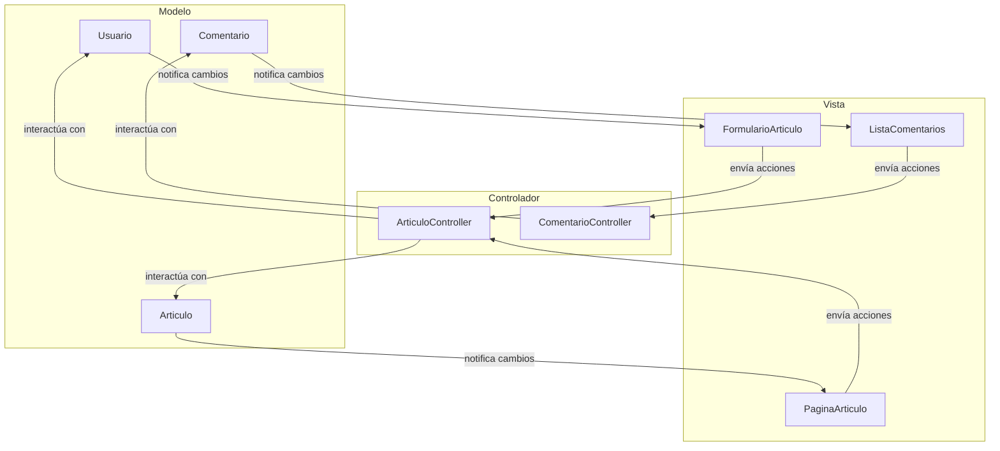

### 🏫 **Institución:** IES 9-018 "Gobernador Celso Jaque"
### 📚 **Carrera:** Tecnicatura Superior en Desarrollo de Software
### 📖 **Materia:** Modelado de Software
### 👨‍🏫 **Profesor:** Paulo Alvarez
---
# Clase 3: Refinando la Arquitectura - Principios, Patrones y Fusión en Git

## 1. Objetivos de la Clase

Al finalizar esta clase, serás capaz de:

*   Evaluar y mejorar la calidad de un diseño de software usando los principios de **Alta Cohesión** y **Bajo Acoplamiento**.
*   Reconocer y aplicar **Patrones de Diseño** comunes (Singleton, Facade) para resolver problemas recurrentes.
*   Estructurar una aplicación siguiendo el patrón de arquitectura **Modelo-Vista-Controlador (MVC)**.
*   Integrar una nueva funcionalidad a la línea principal del proyecto usando **`git merge`**.

---

## 2. Nuestro Proyecto: "Institución Digital"

En las clases anteriores, definimos qué haría nuestro sistema y construimos su estructura básica. Ahora, daremos un paso atrás y nos pondremos el sombrero de "Arquitecto de Software". Nuestro objetivo no es añadir más funcionalidad, sino **mejorar la calidad** de nuestro diseño actual para que sea más robusto, mantenible y escalable a largo plazo.

---

## 3. Conceptos Clave de Hoy

### 3.1. Principios de Diseño: ¿Qué hace que un diseño sea "bueno"?

Un buen diseño no solo funciona, sino que es fácil de entender y modificar.

*   **Término Clave: `Cohesion` - Cohesión (¡Queremos que sea ALTA!)**
    *   **¿Qué es?** Mide si las responsabilidades de una clase están enfocadas y relacionadas entre sí.
    *   **¿Por qué se usa?** Una clase con alta cohesión tiene un único propósito bien definido (ej: la clase `Articulo` solo se ocupa de los datos y lógica de los artículos). Esto las hace más fáciles de entender, reutilizar y mantener.
    *   **Señal de Alarma (Baja Cohesión):** Una clase "Dios" que hace de todo (gestiona artículos, usuarios, comentarios, envía emails, etc.).

*   **Término Clave: `Coupling` - Acoplamiento (¡Queremos que sea BAJO!)**
    *   **¿Qué es?** Mide el grado de dependencia entre dos clases. Si cambias la Clase A, ¿te ves forzado a cambiar la Clase B?
    *   **¿Por qué se usa?** Un bajo acoplamiento significa que las clases son más independientes. Puedes cambiar una sin generar un efecto dominó de errores en todo el sistema. Esto es vital para el mantenimiento.
    *   **Señal de Alarma (Alto Acoplamiento):** Una clase que conoce y manipula los detalles internos (atributos privados) de otra clase.

### 3.2. Patrones de Diseño: Soluciones Probadas a Problemas Comunes

Los patrones de diseño son como recetas de cocina para un desarrollador. Son soluciones generales y reutilizables que la comunidad ha perfeccionado a lo largo del tiempo.

*   **Término Clave: `Design Pattern` - Patrón de Diseño**
    *   **¿Qué es?** Una plantilla o descripción de cómo resolver un problema de diseño recurrente.
    *   **¿Por qué se usa?** Para no reinventar la rueda y para usar un lenguaje común con otros desarrolladores.

### 3.3. Arquitectura MVC: Organizando Nuestro Sistema

*   **Término Clave: `MVC (Model-View-Controller)` - Modelo-Vista-Controlador**
    *   **¿Qué es?** Un patrón de **arquitectura** que divide la aplicación en tres partes:
        1.  **Modelo:** El cerebro. Contiene los datos y la lógica de negocio (nuestras clases `Articulo`, `Usuario`, `Comentario`). No sabe nada de cómo se ven las cosas.
        2.  **Vista:** La cara. Es la interfaz de usuario (los HTML, las pantallas). Muestra los datos del Modelo al usuario. No contiene lógica compleja.
        3.  **Controlador:** El intermediario. Recibe las acciones del usuario desde la Vista (ej: un clic en un botón), le da órdenes al Modelo y actualiza la Vista.
    *   **¿Por qué se usa?** Para separar las responsabilidades. Permite que un diseñador trabaje en la Vista mientras un programador trabaja en el Modelo, sin interferir entre sí.

---

## 4. Manos a la Obra: Refactorizando "Institución Digital"

### Tutorial Paso a Paso

**Paso 1: Analizar y Refactorizar Nuestro Diagrama de Clases**

Tomemos nuestro Diagrama de Clases de la Clase 2. Preguntémonos:

*   **Cohesión:** ¿Hay alguna clase con demasiadas responsabilidades? Quizás la clase `Usuario` no debería gestionar el `login()` y `logout()`. Podríamos crear una nueva clase `ServicioAutenticacion` que se encargue de eso. Esto aumenta la cohesión de `Usuario` (ahora solo representa los datos del usuario) y crea una nueva clase cohesiva.
*   **Acoplamiento:** ¿Cómo se comunican las clases? Si una clase necesita crear a otra, en lugar de hacerlo directamente, podemos usar un patrón... (ver siguiente paso).

**Paso 2: Aplicar Patrones de Diseño**

*   **Problema:** En nuestro Diagrama de Secuencia, vimos que un `ComentarioController` creaba un objeto `Comentario`. Esto acopla el Controlador a la clase concreta `Comentario`. ¿Y si mañana queremos diferentes tipos de comentarios?
*   **Solución (Patrón Facade):** Podemos pensar en una clase `SistemaBlog` que actúe como una **fachada (Facade)**. La interfaz de usuario (la Vista) no hablará directamente con los controladores de artículos o comentarios. Simplemente le dirá a la fachada: `sistema.publicarArticulo(datos)` o `sistema.dejarComentario(datos)`. Esta fachada oculta la complejidad interna y reduce el acoplamiento.

**Paso 3: Organizar con Arquitectura MVC**

Ahora, distribuyamos nuestras clases en las tres capas de MVC. Esto no es un diagrama UML formal, sino un diagrama de paquetes o conceptual.

1.  **Capa del Modelo:** Aquí van nuestras clases de negocio. Son el corazón de la aplicación.
    *   `Usuario`, `Articulo`, `Comentario`.
2.  **Capa de la Vista:** Aquí irían las plantillas visuales. No las diagramamos en detalle, pero las representamos como un paquete.
    *   `FormularioArticulo`, `PaginaArticulo`, `ListaComentarios`.
3.  **Capa del Controlador:** Aquí van los intermediarios que responden a las acciones del usuario.
    *   `ArticuloController`, `ComentarioController`.

**Resultado Esperado (Conceptual - Diagrama MVC):**



> **Nota para el estudiante:** Puedes copiar el código anterior y pegarlo en [mermaid.live](https://mermaid.live/) para visualizar el diagrama y experimentar con él.

---

## 5. Control de Versiones con Git: Integrando Nuestro Trabajo

Trabajamos en la rama `feature/comentarios` para no afectar la rama principal `main`. Ahora que la funcionalidad está diseñada y estamos contentos con ella, es hora de **fusionarla** de vuelta a `main`.

*   **Término Clave: `merge` - Fusionar**
    *   **¿Qué es?** El proceso de tomar los cambios de una rama e integrarlos en otra.
    *   **¿Por qué se usa?** Para incorporar una nueva funcionalidad o una corrección de error a la línea de desarrollo principal.

### Comandos de Git para Hoy

1.  **`git checkout main`**
    *   **¿Qué hace?** Nos movemos a la rama que va a **recibir** los cambios.

2.  **`git merge <nombre-rama-a-fusionar>`**
    *   **¿Qué hace?** Trae todos los commits de la rama especificada y los integra en la rama actual.
    *   **Comando:** `git merge feature/comentarios`

3.  **`git branch -d <nombre-rama>`**
    *   **¿Qué hace?** Elimina una rama que ya no es necesaria.
    *   **¿Por qué se usa?** Para mantener limpio nuestro repositorio. Una vez que una rama de `feature` se ha fusionado, generalmente ya no se necesita.
    *   **Comando:** `git branch -d feature/comentarios`

**Nuestro Flujo de Trabajo Hoy:**

1.  Primero, asegúrate de que todos tus cambios en la rama `feature/comentarios` están guardados con `git commit`.
2.  Regresa a la rama principal:
    ```bash
    git checkout main
    ```
3.  Fusiona la rama de comentarios en main:
    ```bash
    git merge feature/comentarios
    ```
    *Git creará un nuevo "commit de fusión" para registrar esta integración.*
4.  Una vez fusionada, puedes eliminar la rama de forma segura:
    ```bash
    git branch -d feature/comentarios
    ```
5.  Verifica el historial para ver la línea de tiempo unificada:
    ```bash
    git log --oneline --graph --all
    ```

¡Has completado un ciclo de desarrollo profesional: crear una rama, trabajar en ella y fusionarla de nuevo!

---

## 6. Recursos Adicionales

*   **Principios (Cohesión y Acoplamiento):** [Acoplamiento y Cohesión. Calidad del Software - codigofacilito](https://www.youtube.com/watch?v=3M2T3-dY_jY)
    *   *Explica estos conceptos abstractos con analogías y ejemplos de código muy claros.*
*   **Patrones de Diseño:** [¿Qué son los Patrones de Diseño de Software? - HolaMundo](https://www.youtube.com/watch?v=p3nQUZqI-M4)
    *   *Una excelente introducción conceptual que responde al "porqué" de los patrones.*
*   **Arquitectura MVC:** [¿Qué es el modelo MVC? - codigofacilito](https://www.youtube.com/watch?v=3M2T3-dY_jY)
    *   *Desmitifica MVC, explicando cada componente y cómo se comunican de forma muy sencilla.*

---

## 7. Resumen y Cierre del Curso

Hoy hemos elevado nuestro diseño de "funciona" a "está bien hecho". Hemos aprendido que la calidad del software no es un accidente, sino el resultado de aplicar principios y patrones de diseño probados. Hemos visto cómo organizar nuestro sistema de una manera profesional con MVC.

**A lo largo de estas tres clases, hemos recorrido un mini-ciclo de desarrollo:**

1.  **Entendimos los requisitos** del usuario con Casos de Uso.
2.  **Diseñamos la estructura y el comportamiento** con diagramas de Clases, Secuencia y Actividad.
3.  **Refinamos nuestra arquitectura** para asegurar su calidad y mantenibilidad.
4.  **Gestionamos todo el proceso** con un control de versiones profesional usando Git.

Este conocimiento es la base fundamental sobre la que se construye cualquier proyecto de software de calidad. ¡Felicidades por completar este viaje!


DIAGRAMA 1: Diagrama de Clases Refactorizado (Alta Cohesión + Bajo Acoplamiento)

Cambios aplicados:

Usuario ya NO gestiona login/logout → se crea ServicioAutenticacion.

Controladores ya NO crean objetos concretos → eso lo maneja SistemaBlog (Patrón Facade).

🔹 Mermaid – Diagrama de clases refactorizado
classDiagram
    class Usuario {
        -id: int
        -nombre: string
        -email: string
    }

    class Articulo {
        -id: int
        -titulo: string
        -contenido: string
        +publicar()
    }

    class Comentario {
        -id: int
        -texto: string
        -fecha: Date
    }

    class ServicioAutenticacion {
        +login(email, password)
        +logout(usuario)
    }

    class ArticuloController {
        +crearArticulo(datos)
        +verArticulo(id)
    }

    class ComentarioController {
        +crearComentario(datos)
        +listarComentarios(idArticulo)
    }

    class SistemaBlog {
        +publicarArticulo(datos)
        +dejarComentario(datos)
    }

    %% Relaciones
    Usuario --> Comentario
    Articulo --> Comentario : "1..*"
    ArticuloController --> SistemaBlog
    ComentarioController --> SistemaBlog
    SistemaBlog --> Articulo
    SistemaBlog --> Comentario
    ServicioAutenticacion --> Usuario : "gestiona"

✅ DIAGRAMA 2: Patrón Facade en acción
🔹 Mermaid – Facade simplificado
classDiagram
    class SistemaBlog {
        +publicarArticulo(datos)
        +dejarComentario(datos)
    }

    class ArticuloController
    class ComentarioController
    class Articulo
    class Comentario

    ArticuloController --> SistemaBlog
    ComentarioController --> SistemaBlog
    SistemaBlog --> Articulo
    SistemaBlog --> Comentario


Este diagrama muestra cómo evitamos que los controladores creen directamente entidades → bajo acoplamiento.

✅ DIAGRAMA 3: Arquitectura MVC (Paquetes)
🔹 Mermaid – Diagrama conceptual MVC
flowchart LR
    subgraph Modelo
        Usuario
        Articulo
        Comentario
    end

    subgraph Controlador
        ArticuloController
        ComentarioController
        ServicioAutenticacion
        SistemaBlog
    end

    subgraph Vista
        FormularioArticulo
        PaginaArticulo
        ListaComentarios
    end

    Vista --> Controlador
    Controlador --> Modelo
    Modelo --> Controlador
    Controlador --> Vista

✅ DIAGRAMA 4: Diagrama de Secuencia Mejorado (con Facade)

Este diagrama muestra cómo fluye la acción al crear un comentario.

🔹 Mermaid – Diagrama de secuencia
sequenceDiagram
    participant V as Vista (Formulario comentario)
    participant CC as ComentarioController
    participant SB as SistemaBlog (Facade)
    participant C as Comentario
    participant A as Articulo

    V->>CC: enviarComentario(datos)
    CC->>SB: dejarComentario(datos)
    SB->>A: obtenerArticulo(id)
    SB->>C: crearComentario(texto)
    C-->>SB: comentarioCreado
    SB-->>CC: operación exitosa
    CC-->>V: mostrarConfirmación()