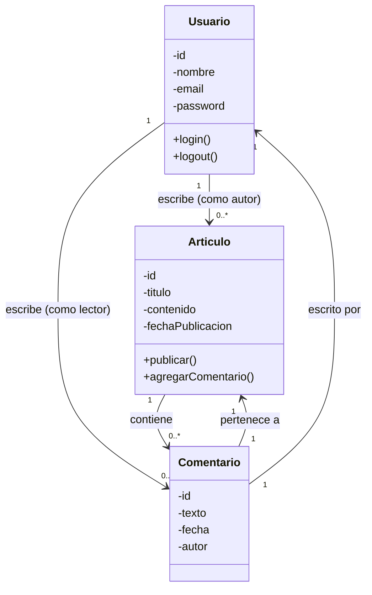
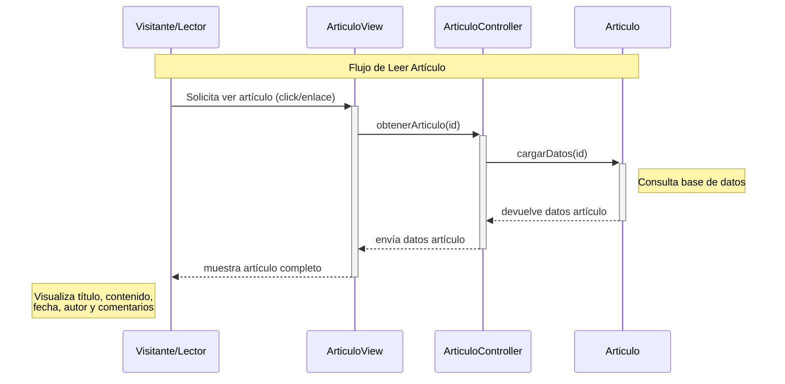
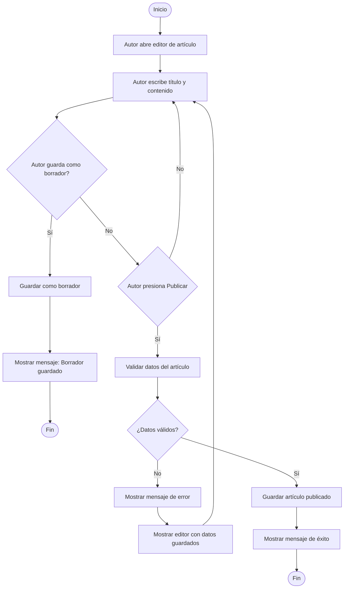

## Camila Scheurer 
## Clase 2
## Diagramas

### Diagrama de clases

```mermaid
    classDiagram
    class Usuario {
        -id
        -nombre
        -email
        -password
        +login()
        +logout()
    }

    class Articulo {
        -id
        -titulo
        -contenido
        -fechaPublicacion
        +publicar()
        +agregarComentario()
    }

    class Comentario {
        -id
        -texto
        -fecha
        -autor
    }

    Usuario "1" --> "0..*" Articulo : escribe (como autor)
    Usuario "1" --> "0..*" Comentario : escribe (como lector)
    Articulo "1" --> "0..*" Comentario : contiene
    Comentario "1" --> "1" Articulo : pertenece a
    Comentario "1" --> "1" Usuario : escrito por

```

### Diagrama de Secuencia

```mermaid
    sequenceDiagram
    participant Visitante as Visitante/Lector
    participant ArticuloView as ArticuloView
    participant ArticuloController as ArticuloController
    participant Articulo as Articulo

    Note over Visitante, Articulo: Flujo de Leer Artículo

    Visitante->>+ArticuloView: Solicita ver artículo (click/enlace)
    ArticuloView->>+ArticuloController: obtenerArticulo(id)
    ArticuloController->>+Articulo: cargarDatos(id)
    
    Note right of Articulo: Consulta base de datos
    
    Articulo-->>-ArticuloController: devuelve datos artículo
    ArticuloController-->>-ArticuloView: envía datos artículo
    ArticuloView-->>-Visitante: muestra artículo completo
    
    Note left of Visitante: Visualiza título, contenido,<br/>fecha, autor y comentarios
```

### Diagrama de Actividad

```mermaid
    flowchart TD
    A([Inicio]) --> B[Autor abre editor de artículo]
    B --> C[Autor escribe título y contenido]
    C --> D{Autor guarda como borrador?}
    D -->|Sí| E[Guardar como borrador]
    E --> F[Mostrar mensaje: Borrador guardado]
    F --> G([Fin])
    
    D -->|No| H{Autor presiona Publicar}
    H -->|No| C
    
    H -->|Sí| I[Validar datos del artículo]
    I --> J{¿Datos válidos?}
    J -->|No| K[Mostrar mensaje de error]
    K --> L[Mostrar editor con datos guardados]
    L --> C
    
    J -->|Sí| M[Guardar artículo publicado]
    M --> N[Mostrar mensaje de éxito]
    N --> O([Fin])
```