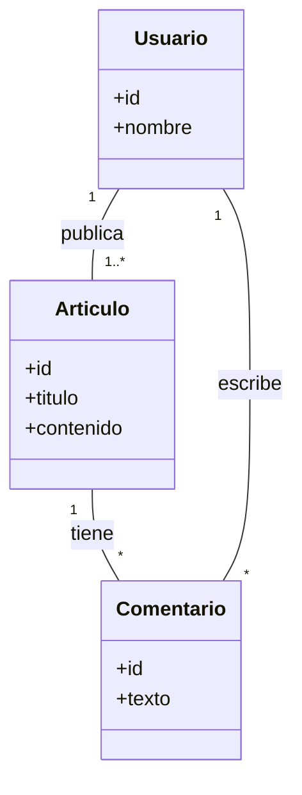

### 🏫 **Institución:** IES 9-018 "Gobernador Celso Jaque"
### 📚 **Carrera:** Tecnicatura Superior en Desarrollo de Software
### 📖 **Materia:** Modelado de Software
### 👨‍🏫 **Profesor:** Paulo Alvarez
---
# Diagrama General del Sistema: "Institución Digital"

Este documento presenta una visión general y evolutiva del sistema "Institución Digital" a través de diagramas Mermaid. A medida que avanzamos en las clases, el nivel de detalle y la complejidad de los diagramas aumentan.

> **Nota para el estudiante:** Puedes copiar el código de cualquier diagrama Mermaid y pegarlo en [mermaid.live](https://mermaid.live/) para visualizarlo y experimentar con él.

## 1. Visión General del Sistema (Conceptual)

Este diagrama muestra las entidades principales del sistema y sus relaciones a un alto nivel.

> **Nota para el estudiante:** Puedes copiar el código de cualquier diagrama Mermaid y pegarlo en [mermaid.live](https://mermaid.live/) para visualizarlo y experimentar con él.

## 2. Evolución Detallada de los Diagramas

Para ver los diagramas con mayor detalle y cómo evolucionan a lo largo del curso, consulta los siguientes archivos:

*   **Clase 1: Diagrama de Casos de Uso** - [clase-1-introduccion-uml.md](./clase-1-introduccion-uml.md)
*   **Clase 2: Diagrama de Clases, Secuencia y Actividad** - [clase-2-diagramas-uml.md](./clase-2-diagramas-uml.md)
*   **Clase 3: Diagrama de Arquitectura MVC** - [clase-3-principios-patrones-arquitecturas.md](./clase-3-principios-patrones-arquitecturas.md)
