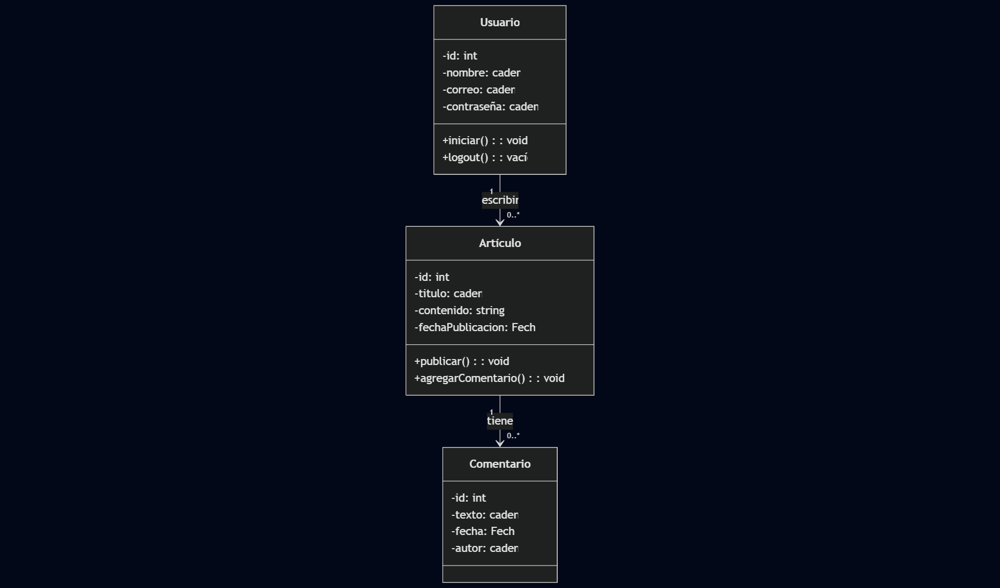
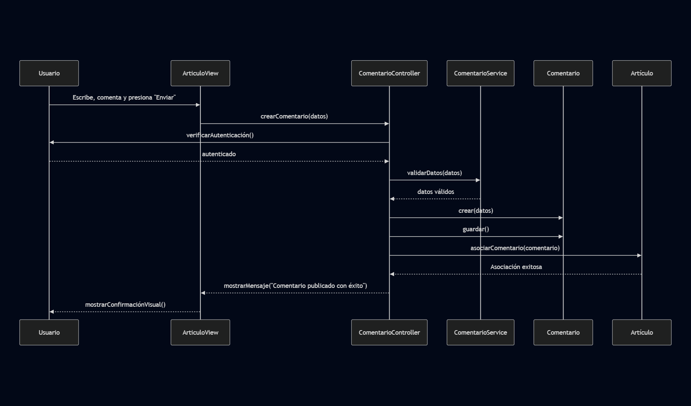
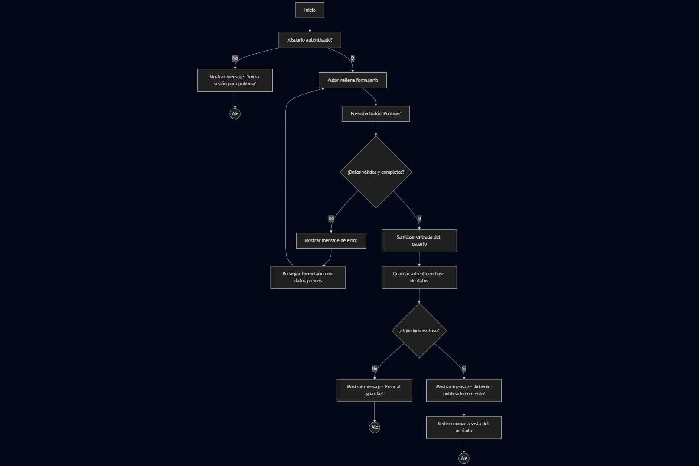

#Clase 2: Construyendo los Cimientos - Clases, Secuencias y Ramas de Git
##Manos a la Obra: Construyendo "Institución Digital"

**Paso 1: Evolucionar el Diagrama de Casos de Uso**

Con la nueva funcionalidad de comentarios, nuestro diagrama crece. Ahora el `Visitante` también participa en el caso de uso **`Comentar Artículo`**. El `Autor` también puede **`Leer Comentarios`**

1. **Usuario**: con atributos como `id`, `nombre`, `correo`, `contraseña`, y métodos para iniciar y cerrar sesión.
2. **Artículo**: con atributos como `id`, `título`, `contenido`, `fechaPublicación`, y métodos para publicar y agregar comentarios.
3. **Comentario**: con atributos como `id`, `texto`, `fecha`, `autor`.

---
### Diagrama de clases (Mermaid)

classDiagram
    class Usuario {
        -id: int
        -nombre: string
        -correo: string
        -contraseña: string
        +iniciar(): void
        +logout(): void
    }

    class Articulo {
        -id: int
        -titulo: string
        -contenido: string
        -fechaPublicacion: Date
        +publicar(): void
        +agregarComentario(): void
    }

    class Comentario {
        -id: int
        -texto: string
        -fecha: Date
        -autor: string
    }

    Usuario "1" --> "0..*" Articulo : escribe
    Articulo "1" --> "0..*" Comentario : tiene
    
    ```


!
**Paso 2: Crear el Diagrama de Clases**

### Diagrama de casos de uso (Mermaid)

El siguiente diagrama resume las nuevas interacciones: el `Visitante` puede comentar artículos y el `Autor` puede leer los comentarios.

1. **Autenticación del usuario**
   - Se verifica si el usuario está autenticado antes de permitir la creación del comentario.
   - Esto mejora la seguridad y evita comentarios anónimos no deseados.

2. **Validación de datos**
   - Se introduce un servicio (`ComentarioService`) para validar los datos del comentario antes de guardarlo.
   - Asegura que el contenido sea correcto y completo.

3. **Separación de responsabilidades**
   - Se agrega `ComentarioService` para manejar la lógica de validación, manteniendo limpio el controlador.
   - Mejora la escalabilidad y el mantenimiento del sistema.

4. **Asociación explícita del comentario al artículo**
   - El comentario se vincula directamente al artículo correspondiente.
   - Esto garantiza trazabilidad y coherencia en la base de datos.

5. **Confirmación visual al usuario**
   - Se incluye una respuesta visual en la interfaz (`ArticuloView`) para informar que el comentario fue publicado con éxito.
   - Mejora la experiencia del usuario.

6. **Manejo de errores (implícito)**
   - Aunque no se muestra en detalle, el flujo contempla validaciones y autenticación, lo que permite manejar errores como datos inválidos o usuarios no autenticados.


Estas mejoras hacen que el flujo sea más **robusto, seguro y profesional**, alineado con buenas prácticas de desarrollo web. ¿Querés que lo llevemos a código real o lo conectemos con tu backend actual?

```
sequenceDiagram
    participant Usuario
    participant ArticuloView
    participant ComentarioController
    participant ComentarioService
    participant Comentario
    participant Articulo

    Usuario ->> ArticuloView: Escribe comentario y presiona "Enviar"
    ArticuloView ->> ComentarioController: crearComentario(datos)
    ComentarioController ->> Usuario: verificarAutenticación()
    Usuario -->> ComentarioController: autenticado

    ComentarioController ->> ComentarioService: validarDatos(datos)
    ComentarioService -->> ComentarioController: datos válidos

    ComentarioController ->> Comentario: crear(datos)
    ComentarioController ->> Comentario: guardar()

    ComentarioController ->> Articulo: asociarComentario(comentario)
    Articulo -->> ComentarioController: asociación exitosa

    ComentarioController -->> ArticuloView: mostrarMensaje("Comentario publicado con éxito")
    ArticuloView -->> Usuario: mostrarConfirmaciónVisual()
````


  
**Paso 3: Modelar la Interacción con un Diagrama de Secuencia**
### Diagrama de casos de uso — Entradas y salidas (Mermaid)

El diagrama siguiente describe las entradas y salidas principales de cada caso de uso relevante para el sistema de comentarios.
1. **Verificación de autenticación**
   - Se agregó un paso inicial para comprobar si el usuario está autenticado antes de permitirle publicar.
   - Mejora la seguridad y evita publicaciones anónimas no autorizadas.

2. **Validación y sanitización de datos**
   - Se separó la validación de datos del formulario y se añadió sanitización para evitar entradas maliciosas.
   - Esto protege la base de datos y mejora la integridad del contenido.

3. **Manejo de errores de guardado**
   - Se contempló el caso en que el guardado en la base de datos falle, mostrando un mensaje claro al usuario.
   - Aporta robustez al sistema y facilita el diagnóstico de fallos.

4. **Confirmación visual y redirección**
   - Tras una publicación exitosa, se muestra un mensaje de éxito y se redirige al usuario a la vista del artículo.
   - Mejora la experiencia de usuario y cierra el flujo de forma coherente.

5. **Separación de decisiones**
   - Se dividieron los puntos de decisión en pasos más específicos (autenticación, validación, guardado), lo que facilita el mantenimiento y la trazabilidad del flujo.

Este nuevo flujo es más **seguro, claro y profesional**, ideal para implementarlo en un sistema real con backend y frontend conectados. ¿Querés que lo traduzcamos a controladores Express, vistas Django o lógica React? Estoy listo para ayudarte a construirlo.


```graph TD
    start[Inicio] --> Verificar_autenticacion[¿Usuario autenticado?]
    Verificar_autenticacion -- No --> Mostrar_mensaje_login[Mostrar mensaje: 'Inicia sesión para publicar']
    Mostrar_mensaje_login --> Fin1((Fin))

    Verificar_autenticacion -- Sí --> Autor_rellena_formulario[Autor rellena formulario]
    Autor_rellena_formulario --> Presiona_publicar[Presiona botón 'Publicar']
    Presiona_publicar --> Validar_datos{¿Datos válidos y completos?}

    Validar_datos -- No --> Mostrar_error[Mostrar mensaje de error]
    Mostrar_error --> Recargar_formulario[Recargar formulario con datos previos]
    Recargar_formulario --> Autor_rellena_formulario

    Validar_datos -- Sí --> Sanitizar_datos[Sanitizar entrada del usuario]
    Sanitizar_datos --> Guardar_en_BD[Guardar artículo en base de datos]
    Guardar_en_BD --> Verificar_guardado{¿Guardado exitoso?}

    Verificar_guardado -- No --> Mostrar_error_guardado[Mostrar mensaje: 'Error al guardar']
    Mostrar_error_guardado --> Fin2((Fin))

    Verificar_guardado -- Sí --> Mostrar_exito[Mostrar mensaje: 'Artículo publicado con éxito']
    Mostrar_exito --> Redireccionar[Redireccionar a vista del artículo]
    Redireccionar --> Fin3((Fin))


	%% Notas de entrada/salida asociadas a cada caso de uso
	note right of (Comentar Artículo) : Entrada: texto del comentario, autor (nombre/email opcional)\nSalida: comentario publicado, confirmación visual
	note right of (Leer Comentarios) : Entrada: petición de listado de comentarios\nSalida: lista de comentarios (texto, autor, fecha)
	note right of (Publicar Artículo) : Entrada: título, contenido, metadatos\nSalida: artículo publicado, visibilidad en la lista
	note right of (Gestionar Artículo) : Entrada: solicitudes de editar/eliminar\nSalida: artículo actualizado o eliminado, registro de cambios
```


> Estas notas ayudan a entender qué información entra y qué resultado produce cada caso de uso; son útiles para diseñar las interfaces y las operaciones backend.
